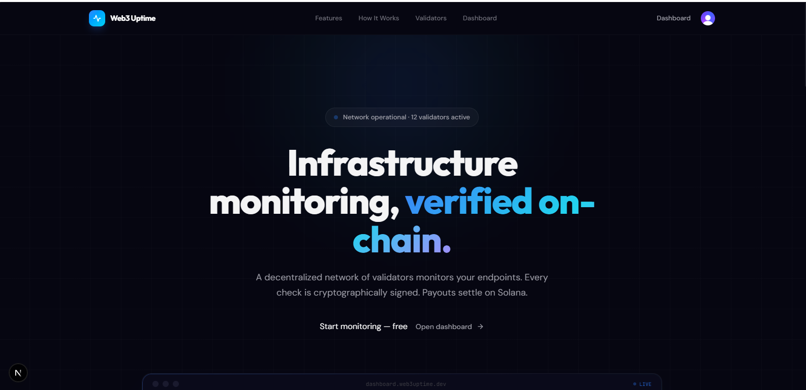
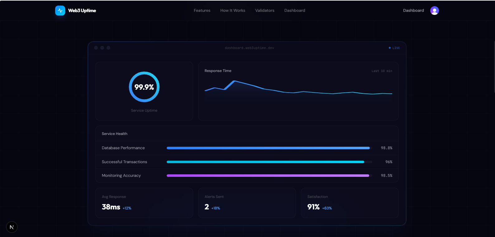
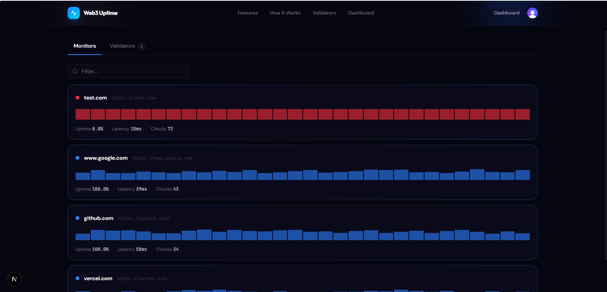

# Web3 Uptime

A decentralized infrastructure monitoring network built on the Solana ecosystem. This repository implements a monorepo architecture for a global network of monitoring nodes (validators) coordinated by a central orchestrator (hub).
 

## System Architecture

The network operates on a hub-and-spoke model:

- **Validators**: Lightweight agents that perform high-precision TCP and HTTP health checks on target infrastructure.
- **Hub**: A central websocket server that manages validator registration, task distribution, and cryptographic proof verification.
- **Payout Engine**: An automated system within the hub that distributes SOL rewards to validator public keys via the Solana Devnet based on verified performance.

## Project Structure

### apps/

- **api**: A REST API that serves real-time and historical network data to the frontend dashboard.
- **frontend**: A Next.js application featuring a WebGL-based 3D network visualization and node operator instructions.
- **hub**: The core websocket orchestrator responsible for validator communication and reward distribution logic.
- **validator**: The internal implementation of the validator agent used for testing and local network participation.

### packages/

- **common**: Shared TypeScript interfaces, types, and utility functions used across the entire monorepo.
- **db**: The central database layer containing the Prisma schema and client for managing validator records and uptime history.

## Core Technologies

- **Runtime**: Bun (for high-performance IO and native TypeScript support)
- **Blockchain**: Solana Web3.js (for cryptographic handshakes and devnet payouts)
- **Database**: PostgreSQL with Prisma ORM
- **Frontend**: Next.js with WebGL (COBE) for data visualization

## Development Setup

1. Install dependencies from the root:

   ```bash
   bun install
   ```

2. Configure environment variables in each relevant app directory based on the provided .env.example files.

3. Initialize the database:

   ```bash
   cd packages/db
   bunx prisma generate
   bunx prisma db push
   ```

4. Launch services:
   - Hub: `cd apps/hub && bun run index.ts`
   - API: `cd apps/api && bun run index.ts`
   - Frontend: `cd apps/frontend && bun run dev`
